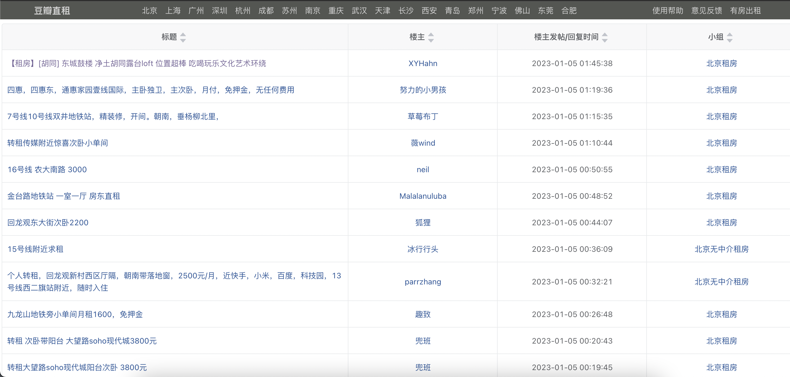

# 豆瓣租房爬虫

```py
import requests
import json

url = 'https://dbzz.house/api'

city = '北京'

time = '7'

size = '10'

requestStr = url + '/search?city=' + city + '&keyword=&recent_days=' + time + '&publisher_role=&unique_flag=true&page_size=' + size + '&current_page=1'

res = requests.get(requestStr)

data = json.loads(res.text)

print(data)

fo = open(city + '租房.json', 'w')

fo.write(res.text)

fo.close()

```



## 使用方式

1. 可以更改城市：city
2. 可以更改爬取数目: size
3. 可以更改爬取页数

## 数据解析

```json
{
  "postId": "281147932",
  "postTitle": "【租房】[胡同] 东城鼓楼 净土胡同露台loft 位置超棒 吃喝玩乐文化艺术环绕",
  "postBody": "总共3层（包括露台） 每层15平方米 门朝南窗子朝北\n租金6000元 押金3000元 最好半年付\n水电暖气、家电家具都齐全 基本都会留下\n年后可能会很快租掉 希望年前了却一桩心愿\n祝大家新年快乐！\n一层客厅\n一层客厅\n一层客厅\n一层门厅\n一层门厅\n一层厨房\n一层卫生间\n二层卧室\n二层卧室\n二层卧室\n二层工作间\n二层工作间\n二层工作间\n二层工作间\n屋顶露台\n屋顶露台\n屋顶露台",
  "signatureId": "281147932",
  "opId": "xyhahn",
  "nickName": "XYHahn",
  "groupId": "jumei",
  "groupName": "北京租房",
  "postCreateTime": "2023-01-05 01:45:38",
  "opLatestCommentTime": "2023-01-05 01:45:38"
}
```

浏览器打开以下地址

'https://www.douban.com/group/topic/' + postId